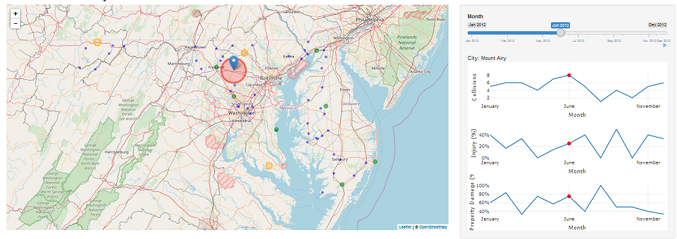
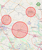
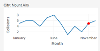
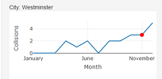

```{r setup, include=FALSE}
knitr::opts_chunk$set(echo = FALSE)

library(scales)
library(plotly)

# load in data sets
load("data/cities.gps.RObject")
load("data/collision.final.RObject")

# read in data and filter out empty and not applicable entries
collision.raw <- read.csv("data/2012_Vehicle_Collisions_Investigated_by_State_Police.csv", header=T)

# keep only focus variables
collision <- collision.raw[,c("ACC_TIME", "DAY_OF_WEEK", "INJURY", "PROP_DEST")]

```

## Introduction

From the data set, https://catalog.data.gov/dataset/2012-vehicle-collisions-investigated-by-state-police-4fcd0

- In 2012, the State of Maryland had `r format(nrow(collision), big.mark=",")` accidents.
- `r nrow(cities.gps)` cities had recorded at least one accidient.
- `r percent(round(nrow(collision[collision$INJURY=="YES",])/nrow(collision),2))` had injuries and `r percent(round(nrow(collision[collision$PROP_DEST=="YES",])/nrow(collision),2))` resulted in property damage.

### Questions

- Is there any difference in the number of collisions due to location?
- What city has the highest number of collisions?
- Are there any cities trending to higher collisions over time?

## Collision Data Visualization

<div class="centered"></div>

  * Circles and color represent number of collisions in the city.
  * City selection for time series plots.
  * Time selection and animated sequence by start/stop button
  * Time series of data for number of collsions, percent with injuries, and percent with property damage.
  * Red dot represents the moment in time for visualization

## Results

---------------------------------------------------------------------------- --------------------------------
Is there any difference in the number of collisions due to location?<br><br>        
The area around Mount Airy has large number of collisions compared to                
the rest of Maryland.  

What city has the highest number of collisions?<br><br>Mount Airy has the
largest number of collisions than the rest of Maryland.                             


Are there any cities trending to higher collisions over time?<br><br>               
In 2012, Westminster has a trend of rising collisions over time.
---------------------------------------------------------------------------- --------------------------------

## Conclusions

* Easy identification of areas in Maryland where collisions are frequent.
* Identification of patterns over time and geographical space.
* Identify trends in different aspects of the data (i.e. Injuries).

* Visualization tool can be used with other collision data with the following variables:
    * Date and Time
    * Location (Latitude and Longitude and/or City)
    * Injuries
    * Property Damage

Thank you for your time!